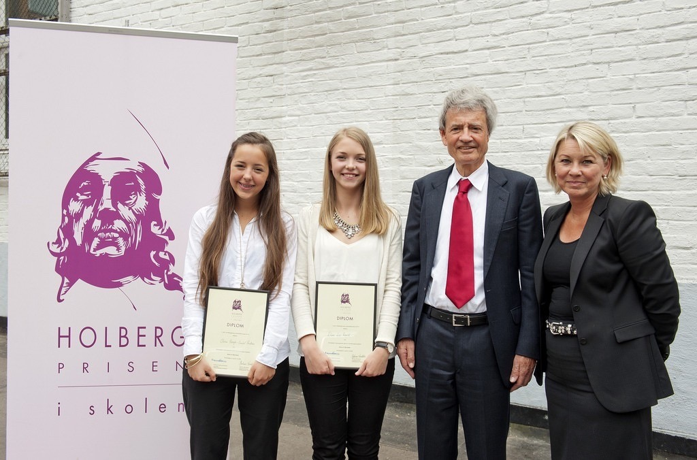

# Forord

Du leser nå i en digital bok som vi har laget for elever i videregående skole som skal gjøre et humanistisk og\eller et samfunnsvitenskapelig forskningsprosjekt. Det er laget av Holbergprisen i skolen, og er spesielt tilpasset forskerkonkurransen som Holbergprisen arrangerer hvert år. Innholdet passer også godt for skoleklasser som ikke deltar i konkurransen, men som vil gjennomføre et forskningsprosjekt. Dere finner fremdeles mange nyttige tips og innsikter i [det forrige metodeheftet ble laget av Gisle Andersen i 2008][2]. I denne boken har vi lagt mer vekt på hvordan dere skal komme i gang med de forskjellige delene et forskningsprosjekt gjerne består av. Det har også lagt litt større vekt på humanistiske forskningsmetoder.

Denne boken er en starthjelp til å forske innenfor humanistiske og samfunnsvitenskapelige fag. Bak hver prosedyre og hvert prinsipp ligger det årevis med diskusjon og ulike perspektiver som vi ikke har mulighet å gå inn på her. Forskningslandskapet er alltid i endring og det som virker lurt i dag, trenger ikke nødvendigvis å være det i morgen. Det er allikevel noe som ikke ser ut til å forandre seg. De fleste forskere gjør det de gjør fordi de er nysgjerrige og søker kunnskap som kan hjelpe oss til å forstå verden rundt oss bedre. Det kan være vanskelig, tidkrevende og frusterende, men følelsen av å finne ut noe som ingen visste fra før, eller kunne knuse en allment akseptert myte er alltid verdt strevet. Med denne boken i bakhånd, håper vi at dere får smake på denne erfaringen.

_Lykke til med forskningsprosjektet!_

[Knut Melvær](http://knutmelvaer.no), desember 2014

<a href="http://www.holbergprisen.no/holbergprisen-i-skolen/vinner-2014">Vant Holbergprisen i skolen 2014</a>: Olivia Høegh-Omdal Paulsen og Eline Loe Rønvik fra Elvebakken videregående skole sammen med Holbergprisvinner Michael Cook og næringsminister Monica Mæland. Foto: Marit Hommedal / Scanpix / Holbergprisen

## Om denne boka

Jeg har en mistanke om at forskere ikke helt vet hva de skal gjøre, så skriver de en bok om vitenskapelig metode og hvordan forskning helst burde vært. Metodebøker beskriver ofte en idealtilstand som vi alle kan nikke annerkjennende til, men som vi vet innerst i hjerte ikke alltid stemmer overens med hvordan forskerhverdagen ser ut. Jeg har aldri lest i et kapittel i en metodebok som tar for seg hva man gjør dersom man har så mange eposter i innboksen at man ikke får konsentrert seg skikkelig om forskningsprosjektet, eller hva man gjør når en av informantene blir dypt fornærmet av en eller annen uforklarlig grunn. Når det er sagt, at det finnes så mange metodebøker der ute (spesielt på engelsk), gjør at det føles litt unødvendig å føye til én til i miksen.

Forskningsmetode handler mye om de erfaringene man gjør i møte med det man forsker på. Selv om det er mye teori, så er det også til syvende og sist et håndtverk. Bokstavelig talt. Derfor har jeg i denne boken prøvd å gjøre to ting: (1) Skrive om hvordan man kommer i gang med forskningsprosjektet og hva som kan være lurt å tenke på; og (2) gi noen korte introduksjoner til metodiske opplegg som er overkommelige og forhåpentligvis fungerer som inngangsporter til en uendelig større metodisk verden.

Om du som nå leser dette er forsker selv, så vil du kanskje reagere på at denne boken ikke nevner det som for deg er helt sentrale metodiske problemstillinger eller ikke gir den helt ferske og optimaliserte teknikken som nylig har blitt publisert i ditt felt. Du har helt rett. Denne boka er først og fremst skrevet for elever i videregående skole. De er ikke så fremmed for mange av de metodiske utfordringene vi selv møter (det har skjedd _mye_ i norskfaget de siste årene), men dette er samtidig sannsynligvis deres første skikkelig akademiske arbeid. Vi må alltid ta et steg om gangen, og dette er omtrent det første steget. Når det er sagt, om du har innspill, konstruktiv kritikk eller noe på hjertet, så er du mer enn velkommen å sende meg en [e-post](mailto:knut.melvar@uib.no). Fordelen med å skrive en digital bok, er at den ikke blir satt i stein (eller papir for den saks skyld… med mindre du tar en utskrift av den).

## Hvordan bruke denne boka

Denne boka er først og fremst laget for en digital skjerm. Derfor er tekststykkene litt kortere. Det vil også kunne komme små oppdateringer her og der. Det betyr at dersom dere skal refere til denne boka, så bør dere gjøre det til den digitale versjonen som ligger på nettet. Foreløbig kan dere gjøre det som dere gjør med en vanlig nettside. Her med referansestilen [Chicago forfatter-år](http://sokogskriv.no/kildebruk-og-referanser/referansestiler/chicago-forfatter-aar/):

>   Melvær, Knut, 2015. Forord. Forskning for forskerspirer. Lest . [http://metode.holbergprisen.no/content/index.html](http://metode.holbergprisen.no/content/index.html)

Det som er viktig med referanser er å gjøre det enkelt for leseren å finne kildene man har brukt. Det vil antagelivis være tilstrekkelig å vise til bokens nettside som over. Om man vil bli veldig nerdete og nøye kan man også gå til denne boken på [GitHub](https://github.com/kmelve/forskning-for-forskerspirer) og lenke akkurat den versjonen som man har brukt. Der kan man også se hvordan boka gradvis har utviklet seg, og hvordan jeg mer eller mindre kaotisk har jobbet med den. Det føles litt som å vise frem skittentøyet, men samtidig, det er også i seg selv en demonstrasjon av at forskning og skriving ikke er en strømlinjeformet prosess.

Om dere er på nettsiden vil dere helt øverst finne noen ikoner hvor dere kan vise/skjule innholdsfortegnelsen (<i class="fa fa-align-justify"></i>), endre tekst-størrelse, farger og skrifttype (<i class="fa fa-font"></i>). Det er også mulig å dele kapitler i sosiale medier eller sende det til [instapaper](http://instapaper.com) om man vil lese noe senere. Der kan dere også finne indeks/register () med ordforklaringer og søke i boka (<i class="fa fa-search"></i>).

Denne boka kan også lastes ned som epub (som kan åpnes i ebok-lesere som [Calibre][8112-0001] og [iBooks][8112-0002]), mobi (som kan leses på en [Kindle](https://kindle.amazon.com/)) eller .pdf (greit format dersom man ønsker å skrive ut boka på papir). Disse filene blir automatisk oppdaterte når det kommer endringer på nettsiden.

[8112-0001]: http://calibre-ebook.com/
[8112-0002]: https://www.apple.com/ibooks/
