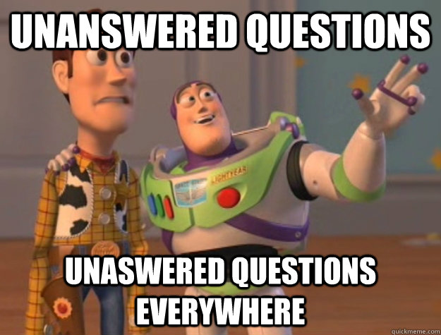

# God forskning starter med gode spørsmål

Ordet «vitenskap» har vi fra det latinske ordet _scientia_ som betyr «kunnskap».[^1] Når det snakkes om «forskning» er det gjerne underforstått at man driver med vitenskap. Ny kunnskap kan ta mange former. Det kan være å finne svar på noe vi ikke visste om verden fra før, eller det kan være å finne et bedre svar på noe som hadde blitt besvart utilfredsstillende fra før. Forskning kan også gå ut på å gå en etablert forklaring på noe i sømmene, for å se om noe egentlig henger sammen på den måten vi tidligere har trodd. Gjennom forskning kan man også finne ut fremgangsmåter som gjør andre forskere bedre i stand til å finne ny kunnskap. De fleste forskere er drevet av en nysgjerrighet og et ønske om å forstå universet bedre.

Det er denne nysgjerrigheten dere bør begynne med å vekke opp (om den ikke er framme i pannelappen fra før). Det er ikke alltid like lett. Heldigvis finnes det måter å lokke frem denne nysgjerrigheten på. Når dere skal velge et tema kan det derfor være greit å starte med en idémyldring. Dere bør dere tenkte på tema som har med menneskelig samfunn og kultur å gjøre, siden Holbergprisen i skolen handler om humaniora og samfunnsvitenskap.

Det er ofte lurt å starte en idémyldring med at hver person på gruppa skriver ned alle tema og spørsmål for seg selv. Så samler man opp alle forslagene felles i gruppen og diskuterer hva som virker mest interessant å jobbe med.

 Slike idémyldringsspørsmål er ofte kan ganske store og ambisiøse. Store og ambisiøse spørsmål er viktige og det er ofte disse som driver og motiverer oss til å forske. Men det er ofte vanskelig å vite i hvilken ende man skal begynne. Da blir neste steg å omformulere spørsmålet slik at man får et prosjekt som kan gjennomføres. Slik er det ofte i vitenskapen også. For å kunne svare på de virkelig store spørsmålene, må man ofte svare på de mindre spørsmålene først. Oppgaven blir derfor å avgrense tema og prosjektet til et konkret forskningsspørsmål. Et forskningsspørsmål er et spørsmål som det er mulig å belyse innenfor den tiden dere har til å gjennomføre prosjektet. Dere trenger heller ikke å hugge denne inn i stein (i hvert fall ikke bokstavelig talt; det ville tatt for lang tid!). Når man går i gang med prosjektet, må man nemlig være åpen for at forskningsspørsmålet må forandres litt på. Det er ganske vanlig, men ett sted må man jo begynne.

## Idémyldring

*   Sett stoppeklokken på **fem minutter**. Skriv ned alt du kommer på som du tror kan være interessant å forske på. Samle og diskutér alle punktene i gruppa. Rangér gjerne de som virker mest interessant.
*   Bruk maks et kvarter på å se gjennom sidene for kultur og samfunn på forskning.no. Skriv ned tema du synes virker interessante. Legg merke til boksen med «relaterte emner», kanskje finner du noe spennende der?
*   Det er også lov å la seg inspirere av tidligere prosjekter i Holbergprisen i skolen.

   [2]: http://jekyll-hyde.no/holberg/1-kom-i-gang-med-forskningen/1-2-hvordan-stille-gode-forskningssporsmal/ (1.2 Hvordan stille gode forskningsspørsmål)

[^1]: På norsk stammer «vitenskap» fra det tyske «Wissenschaft». Det tyske ordet ble brukt til å oversette det latinske «scienta».
