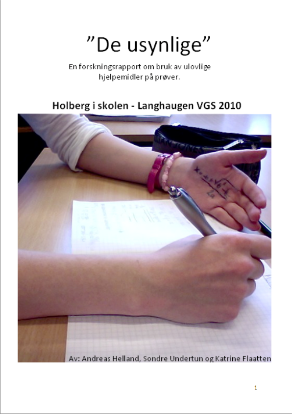

#Hvordan stille gode forskningsspørsmål

Gode forskere stiller gode spørsmål. Mye av forskningsprosessen handler nettopp om å finne spørsmålene som gir oss ny kunnskap dersom vi prøver å finne svaret på dem. Gode spørsmål er ikke nødvendigvis det samme som vanskelige spørsmål; de kan også være enkle eller tilsynelatende selvinnlysende. Noen ganger må forskere stille spørsmål viss svar kan ha en viss nytte eller fortjeneste i samfunnet, andre ganger får forskere anledning til å stille spørsmål utfra sin egen faglige interesse. Når dere skal i gang med dette forskningsprosjektet står dere fritt til å forske på noe som dere tror kan være nyttig for andre å vite noe om, eller undersøke et tema som bare virker interessant i seg selv.

Forhåpentligvis sitter dere nå med en liste med ideer og spørsmål, kanskje dere til og med har en følelse for hva dere kommer til å ende opp med. Det neste skrittet dere må ta er å gjøre dette til en et god forskningsspørsmål som er avgrenset, presis, tydlig og spisset.

## Ikke bit over for mye (selv om det er fristende)

Hvor avgrenset forskningsspørsmålet bør være, avhenger av hvor mye vi vet om temaet fra før og hvordan den skal undersøkes. En enkel måte å gjøre dette på er å avgrense stedsmessig, tidsrom eller med et mindre utvalg/kilder. Et utvalg består ofte av enkeltpersoner, men det kan også være organisasjoner, kommuner, nasjoner eller lignende. I prosjektet om juks i skolen (se [Helland, Undertun, Flaatten 2010](http://www.holbergprisen.no/sites/default/files/2010_skole_langhaugen.pdf "De usynlige: En forskningsrapport om bruk av ulovlige hjelpemidler på prøver.")) består utvalget av skoleungdommer. De avgrenset forskningsspørsmålet med å spørre om «allmennelever på Langhaugen videregående skole». Hadde de spurt om alle elever i hele landet hadde prosjektomfanget åpenbart blitt mye større.

Kilder kan være historiske dokumenter som for eksempel brev, rapporter, regnskap eller avisnotiser. Disse bruker vi til å danne oss et bilde av fortiden. Et forskningsspørsmål i et historisk prosjekt kan se sånn ut: «Hva gjorde egentlig Bergens stolthet og næringsgigant for tyskerne under krigen, hvorfor gikk de med på å bistå okkupasjonsmakten og var det riktig å henlegge etterforskningen av rederiet?» (Dingen & Aanes 2013). Forskningsspørsmålet avgrenses til å handle om ett rederi innenfor en viss tidsperiode.

**Ikke vær redd for å gjøre forskningsspørsmålet for snevert! Det er alltid mye enklere å utvide det om det skal bli nødvendig, enn å avgrense den.**

## Det finnes forskjellige typer spørsmål

Et tidligere prosjekt i _Holbergprisen i skolen_ har forskningsspørsmålet «Hvordan er ungdoms nedlastingsvaner, og hvordan er holdningene deres til ulovlig nedlasting?» ([Johannesen, Nielsen, Lavik, Bjarnason & Andreassen 2007][1]). Selv om det er et spennende spørsmål, kunne den godt blitt spesifisert mer. Kanskje «nedlastning» blir for vidt, kanskje burde det blitt spisset inn til «nedlastning av spill»? Dette krever at vi finner ut noe mer om det vi vil forske på. Det kan vi gjøre for eksempel ved å lese litteratur eller tar kontakt med en forsker som vet noe mer om dette temaet. Forskningsspørsmålet «Hvilke holdninger og erfaringer har elever ved Nordahl Grieg VGS rundt digitaliseringen av skolehverdagen?» ([Barlaup, Strømskog & Råen 2012][2]) er mer konkret. Her kan vi tenke oss at utgangspunktet var en interesse for hvordan bruk av digitale verktøy påvirker skolehverdagen. Ved å avgrense spørsmålet til å handle om holdning og erfaringer hos elever ved én bestemt skole. Å avgrense prosjektet stedsmessig, som en _case-studie_ er en lur måte å gjøre det gjennomførbart på.

   [1]: http://www.holbergprisen.no/images/materiell/2007_skole_Forskningsrapport_Piratpartyet.pdf (Ungdoms nedlastingsvaner og holdninger til ulovlig nedlasting )
   [2]: http://www.holbergprisen.no/sites/default/files/2012_skole_langhaugen.pdf (DIGITALISERINGEN AV SKOLEN)

Forskningsspørsmålet «Fører filmatisering av romaner til økt leselyst?» ([Brun, Haarklau & Natlandsmyr 2009][3]) er ganske annerledes. Her undersøkes et mulig årsaksforhold. Det spørres om _filmatisering_ påvirker _leselyst_. Vi sier med andre ord at _filmatisering_ er den uavhengige variabelen (den som påvirker noe) og _leselyst_ er den avhengige variabelen (det som blir påvirket). Vi kan si at forskningsspørsmålet søker å se om variasjon i variabelen _leselyst_ kan forklares med hvorvidt en bok har blitt filmatisert eller ikke. Dersom vi vil undersøke årsaksforhold er det viktig at vi identifiserer utvalget, variablene og mulige sammenhenger mellom dem i forskningspørsmålet. Da nærmer vi oss et forskningsspørsmål som er utviklet og spisset.

   [3]: http://www.holbergprisen.no/sites/default/files/2009_skole_fana_filmatisering_romaner.pdf (Filmatisering av romaner)

Forskning som forsøker å si noe mer om årsaksforhold eller som søker å forklare _hvorfor_ noe er som det er, er som regel mer interessant enn forskning som kun beskriver hvordan ting er. De fleste forskningsspørsmålene i _Holbergprisen i skolen_ spør _hva_ og _hvordan_-spørsmål. Slike spørsmål er ofte enklere å begynne med, særlig når man ikke vet så mye om temaet fra før av. Da blir hovedoppgaven å finne ut hva som er relevant for å en bedre oversikt over det man forsker på. Det kan være å finne flere mulige årsaker som forklarer hvorfor en situasjon har oppstått, eller finne ut hva folk legger mest vekt på innenfor et tema. I prosjektet om _Det Bergenske Dampskibsselskap_ over spørres det først om hva rederiet gjorde for tyskerne. Det spørres også om _hvorfor._

Å forklare hvorfor noe er tilfelle er kanskje det mest spennende, men også krevende man kan gjøre i forskningen. Vi oppfordrer dere allikevel til å stille hvorfor-spørsmål.

## Teorier, modeller og sammenligninger

«Det er bare en teori», er gjerne noe man hører i diskusjoner. Folk kaller ofte noe som ikke man vet sikkert (eller som de er uenige i) en «teori». I forskning og vitenskapp sikter teori til noe litt annet. En teori er en samling med påstander og forslag til hvordan noe henger sammen, eller hvordan noe best skal forstås.

## Legg fordommene igjen hjemme

Vi har alle fordommer og forestillinger om hvordan verden henger sammen. Fordommer trenger ikke bare å være negative, og kan til og med være nyttige for å raskt kunne ta avgjørelser og valg. I forskningen kan slike fordommer ofte komme i veien for det man skal prøve å finne ut. Selv om ofte forskning kan bekrefte det vi allerede vet, så bør man gå inn med et åpen sinn. En måte å tvinge seg selv til å gjøre dette er for omformulere til det man tror er tilfelle, til det motsatte. Det er også lurt å formulere spørsmålet åpent.
