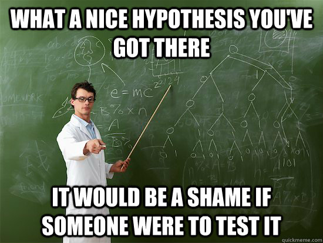

# Hypoteser og delspørsmål kan være nyttige

Når dere har undersøkt mer om temaet dere skal forske på kan dere spesifisere forskningsspørsmålet ytterligere ved å formulere hypoteser. En hypotese er vanligvis en påstand om en antatt sammenheng mellom to eller flere variabler (se ordlista dersom du falt ut nå). Det kan også være en påstand om et historisk forhold. Hensikten med en hypotese er å prøve den ut, enten ved hjelp av kvalitative eller kvantiative undersøkelser. I samfunnsvitenskapene er det mest vanlig å bruke hypoteser i forbindelse med kvantitative opplegg, men det er fullt mulig å bruke hypoteser i kvalitative opplegg også.

Et eksempel på bruk av hypoteser i tidligere prosjekter i _Holbergprisen i skolen_ finner vi i _Hvilke dialektforskjeller finnes i Sør-Odal og Nord-Odal_ (Fjeld, Petersen og Toftegaard 2008). Ut fra forskningsspørsmålet, som er gitt i tittelen, har forskerne laget tre hypoteser (se side fem i rapporten):

>   1. De bruker mer dialektord i Nord-Odal, enn i Sør-Odal
>   2. Itakismen er på vei ut av Odalen.
>   3. Odalsdialekten er i ferd med å bli utvannet.

Den første hypotesen handler om kvantitet, med andre ord, at det er mer av noe én plass enn en annen. Den andre hypotesen handler om bevegelse og utstrekning. _Itakisme_ er et språkvitenskapelig begrep som beskriver et bestemt dialektfenomen. I språkvitenskap er det ikke uvanlig å undersøke hvorvidt bestemte dialekttrekk sprer seg fra et sted til et annet. Derfor burde nok denne hypotesen blitt formulert litt klarere. I dette prosjektet undersøkes det nemlig om _itakismen_ ikke lengre brukes i odals-dialekten (og ikke hvorvidt den har spredd seg til nabobygdene). Den siste hypotesen henger sammen med den foregående og handler om hvorvidt typiske trekk med odalsdialekten er i ferd å forsvinne. For å kunne undersøke disse hypotesene er ikke elevene kun nødt til å hente inn et datamateriale, de måtte også vite hva som utgjør odalsdialekten og hvordan man studerer dialekter og språk.

I stedet for slike hypotetiske påstander kan dere som delspørsmål under selve forskningsspørsmålet. Dette er også en måte å avgrense prosjektet på. I prosjektet _Victoria Terrasse_ (Bakken, Lunde, Nyeborg og Stake 2013) handler forskningsspørsmålet om hvilket betydning denne bygningen har for oslofolk. For å undersøke dette må man også spørre på hvilken måte Victoria Terrasse er et «sted», og på hvilke måter et sted kan ha «betydning» for folk. Tenker man videre på disse spørsmålene blir det enklere å vite hva man bør se etter i kildene, intervju eller feltarbeidet.

Hvilken fremgangsmåte dere velger for å besvare forskningsspørsmålene, er avhengig av hvilken type forskningsspørsmål dere har.

Gå igjennom disse punktene og vurder om forskningsspørsmålet er godt nok:

  1. Hva er det forskningspørsmålet gir dere ny kunnskap om?
  2. Er forskningspørsmålet avgrenset slik at dere kan besvare den i løpet av tiden som er til rådighet?
  3. Dersom dere har et presis forskningspørsmål: Hva er avhengig og uavhengig variabel i forskningspørsmålet? Dersom dere er usikre på dette: Hvilke variabler kan det være interessant å undersøke for å identifisere mulige sammenhenger og påvirkningsforhold.
  4. Er forskningspørsmålet formulert slik at dere bare får bekreftet ting som dere allerede tror eller åpner den opp for at dere faktisk kan finne ut noe nytt?

Nå har dere forhåpentligvis kommet frem til noen forskningspørsmål som dere skal undersøke nærmere. De fleste forskningsspørsmål lar seg undersøke på ulike måter, og det er ikke alltid åpenbart om en innfallsvinkel er bedre enn en annen. Det er viktig å bestemme seg for hvilken type datamateriale dere skal undersøke. Dette avhenger av forskningspørsmålet, hypoteser, hvor mye tid og ressurser dere har og — ikke minst — hva som virker mest interessant.

## Legg fordommene igjen hjemme

Vi har alle fordommer og forestillinger om hvordan verden henger sammen. Fordommer trenger ikke bare å være negative, og kan til og med være nyttige for å raskt kunne ta avgjørelser og valg uten å måtte tenke særlig over det. I forskningen kan slike fordommer ofte komme i veien for det man skal prøve å finne ut. Selv om ofte forskning kan bekrefte det vi allerede vet, så bør man gå inn med et åpen sinn. Dette er spesielt viktig om man skal gå i gang med et kvalitativt forskningsprosjekt. Det innebærer at dere for eksempel bør sette egne holdninger og meninger om det dere skal forske på til side. Det betyr ikke at dere ikke kan ha meninger eller idealer til det dere forsker på, men at akkurat i forskningsarbeidet, så er det ikke det som styrer innsamlingen, analysen, tolkningen og formidlingen av datamaterialet. Derfor bør dere gjøre forskningsspørsmålet åpent. I stedet for forskningsspørsmålet «Hvorfor er John Greene en populær ungdomsforfatter?» kan man stille spørsmålet «hvilken litteratur er det som fenger ungdom og hvorfor gjør den det?».

# Snu opp-ned på forskningsspørsålet: Nullhypoteser

En måte å tvinge seg selv til å ikke kun se etter det som bekrefter hypotesen er å formulere en nullhypotese. Om vi i forskningsspørsmålet har en hypotese om at to grupper er forskjellige, så vil vi i nullhypotesen anta at det ikke er noen forskjeller mellom disse gruppene. Avkrefter vi nullhypotesen, vil det gjøre hypotesen mer sannsynlig. For eksempel:

Forskningsspørsmålet er «Hvordan endrer bruken av sosiale medier seg fra ungdoms- til videregående skole?». En hypotese er at «Det er forskjell mellom elever i ungdoms- og videregående skole i deres til holdninger til Facebook». Nullhypotesen er «Det er *ikke* forskjell mellom elever i ungdoms- og videregående skole i deres holdninger til Facebook». I dette tilfelle vil vi bekrefte hypotesen dersom vi klarer å avkrefte nullhypotesen. Det betyr også at en nullhypotese må formuleres slik at det faktisk er mulig å avkrefte den.
