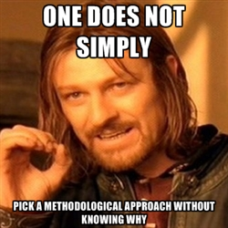

# Forskningsspørsmål og metodevalg henger sammen

 Av og til ender man opp med et forskningspørsmålet hvor det er mer eller mindre åpenbart hvilken forskningsmetode man skal benytte. I humaniora og samfunnsvitenskapene finnes det veldig mange måter å forske på, og det er heller ikke slik at forskere kun bruker én metode, ikke en gang innenfor ett forskningsprosjekt. Det finnes allikevel noen fellestrekk og linjer som gjør det lettere å tre inn forskerhverdagen. En slik oppdeling – som dere vil støte på mange ganger i gjennom livet – er mellom kvalitative og kvantitative metoder.

Forskere tar i bruk kvantitative metoder når de ønsker tallfeste noe, eller «oversette» et datamateriale til tall. Det er mange gode grunner til at vi vil gjøre det. For det første kan det være enklere å få oversikt over kvantitative data. Vi kan lage grafer og statistikk som hjelper oss å få et overblikk og sammenligne forskjellige utvalg og populasjoner. Bruk av kvantitative metoder forutsetter som oftes at man har god kjennskap til feltet man skal studere, og har en klar idé om hvordan man skal gå frem for å få pålitelig data. I mange tilfeller bruker vi kvantitative metoder dersom vi vil lage bred og generell kunnskap om noe.

Med kvalitative metoder søker vi først og fremst å forstå materialet. Dersom man skal forske på et nytt felt er det ofte nødvendig å begynne med kvalitative metoder for å få en idé om hva som er viktig, sentralt eller — på den andre siden — irrelevant og perifert. Med kvalitative metoder forsøker vi å se ting inn i en sammenheng, fra visse teoretiske perspektiv og med forskjellige tolkningsstrategier.

## Lesetips

-   [_Samfunnsvitenskapelige metoder_ av Sigmund Grønmo, 2004](http://bibsys-primo.hosted.exlibrisgroup.com/NB:BIBSYS_ILS961798580)
-   [_Fortida er ikke hva den en gang var_ av Knut Kjeldstadli, 1999](http://urn.nb.no/URN:NBN:no-nb_digibok_2008090300018)
-   [_Metode i mediefag_, av Østbye, Helland, Knapskog og Larsen, 2013](http://bibsys-primo.hosted.exlibrisgroup.com/NB:BIBSYS_ILS132416719)
-   [_Deltagende observasjon_, av Katrine Fangen, 2004](http://urn.nb.no/URN:NBN:no-nb_digibok_2011041308072)
