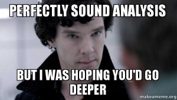

# Fortolkningsmetoder

Kvalitative metoder, eller «fortolkningsmetoder», skal hjelpe oss å gå i dybden av noe for å få en inngående forståelse av fenomenet. De mest vanlige kvalitative metodene går ut på å finne meningsinnholdet i datamaterialet. Hva er det som virker viktig og sentralt? Det er også vanlig at datamaterialet består av dokumenter, intervjuer, deltagende observasjon, nettsider og andre type tekster. I datainnsamlingen er gjerne kvalitative metoder mer fleksible fordi man ikke er knyttet til de samme føringene som man ofte er i kvantitative forskningsopplegg. Det er rom til å stille spørsmål annerledes, eller tilpasse intervjuet og observasjonen om man plutselig ser at noe kan være relevant for forskningspørsmålet. 

Med kvalitative metoder får du ofte dypere og mer omfattende innsikt i et felt, men derfor er det også mer krevende i analysefasen (men dere trenger ikke å bekymre dere for det, alle må begynne en plass). Fordi det er et mye større spenn i hvordan datamaterialet ser ut, så er det vanskelig å gi en enkel oppskrift for hvordan dere gjennomfører et kvalitativt forskningsopplegg. Her er det veldig mange muligheter!

## Forskningsopplegg som tar i bruk kvalitative metoder…

  * Bruker ofte materiale fra forskjellige typer kilder: for eksempel både fra intervjuer, observasjon og tekster.
  * Kan være mer eller mindre systematiske og strukturerte.
  * Analysen består ofte i å fortolke meningen til handlinger eller utsagn i datamaterialet.
  * Tar ofte et dybdeperspektiv – mye informasjon om få personer, en avgrenset periode eller et mindre utvalg tekster.
