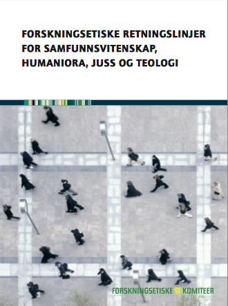

# Forskningsetikk: ansvaret for de man forsker på

Forskningsetikk handler om å reflektere over forholdet mellom forskningen og omverdenen. Det er lett å bli så oppslukt i jakten på ny kunnskap at man overser at forskningsaktiviteten kan få uheldige og uønskede konsekvenser for andre. Det er ikke bare et mål i seg selv å ikke skade andre — verken fysisk, psykisk eller materielt —, men forskningsetikk er viktig for å beholde den vitenskapelige integriteten. Om forskere utøver dårlig forskningsetikk går det ikke bare utover de som er med på prosjektet, det kan også gå utover hele forskningsfeltet og folks tillitt til det vi holder på med.

I Norge har vi noe som heter [_De forskningsetiske komiteene_](https://www.etikkom.no/forskningsetiske-retningslinjer/Samfunnsvitenskap-jus-og-humaniora/) som gir ut retningslinjer for hvordan vi skal forske på en forsvarlig måte. Dersom dere besøker nettsiden kan lese gjennom retningslinjene der og laste dem ned i et [hefte](https://www.etikkom.no/globalassets/documents/publikasjoner-som-pdf/forskningsetiske-retningslinjer-for-samfunnsvitenskap-humaniora-juss-og-teologi-2006.pdf). Selv om det finnes mange konkrete og gode forskningsetiske råd, er det ikke alltid klare svar på hva som er riktig eller galt. Noen forskningsetiske retningslinjer vil falle inn under norsk lov (f.eks taushetsplikt etter § 13 i Forvaltningsloven), andre vil ikke det. Av og til er det umulig å forutsi uheldige situasjoner som kan oppstå i forskningsprosessen.

Det er viktig at forskningsetikk tas på blodig alvor, og at dere diskuterer det sammen i gruppa.

Disse spørsmålene vil og må dere også reflektere over underveis og i forskningsrapporten. Bruk omtrent 20 minutter hvor dere i gruppen diskuterer følgende:

  * Er det noe i forskningsprosessen, i datainnsamlingen eller formidlingen av forskningsresultatene som kan komme til fysisk, psykisk eller materiell skade for informanter eller folks ettermæle og nære familie?

  * Hvordan skal dere sørge for at privatlivet til informantene eller kildene blir ivaretatt?

  * Hvordan skal dere forsikre at alle som er innvolvert i forskningsprosjektet forstår hva prosjektet går ut på og hvordan dere skal bruke datamaterialet? Hvordan forsikrer dere at de kan gi et informert samtykke?

  * Hvordan skal dere sørge for at datamaterialet ikke blir feilrepresentert, forfalsket eller at informasjon som kan endre konklusjonen blir utelatt?

  * Hvordan kan dere unngå plagiat i rapporten?

  * Oppgi hvor dere kommer fra

  * Gjør etikken forskningen dårligere?

Dere vil merke at noen av disse spørsmålene er vanskeligere å svare på, delvis fordi dere ikke helt vet hva dere vil støte på i datainnsamlingen, og delvis fordi de ikke føles like relevant (for eksempel i prosjekter uten informanter). Det kan også være litt demotiverende, fordi man alltid kan forestille seg situasjoner der noe kan gå galt. Så lenge dere har tatt disse spørsmålene på alvor og utøver normal folkeskikk i forskningsprosessen, så vil det nok gå bra.

Det er ofte lett å sammenligne seg med journalister eller massemediene når man skal forske på mennesker. Derfor er det viktig å tenke på at man i journalistikken tar andre etiske hensyn. I mange tilfeller stilles det større krav til anonymisering og kildevern i forskningen.

Dere føler kanskje nå at dette blir et stort og uoverkommelig prosjekt. Da er det lurt å lage en konkret plan for hvor mye tid dere har tenkt å bruke på de forskjellige delene, hva dere skal gjøre når og hvem som skal gjøre hva.

Spør læreren om hvor mange timer dere har til rådighet. Mesteparten av denne tiden vil dere bruke på tre ting:

  * Datainnsamling
  * Analyse
  * Skriving av forskningsrapport

** I praksis vil arbeidet med disse tingene overlappe hverandre. Forskningsrapporten har dere allerede begynt på (dersom dere har fulgt de gode rådene over). Dere bør for eksempel tett opp til datainnsamlingen skrive ned noen refleksjoner om hvordan den gikk. Mye av analysen gjør dere når dere skriver om datamerialet. **
