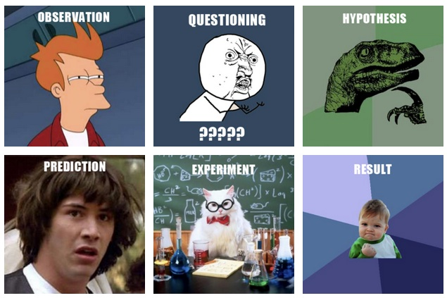

# Hvordan planlegge forskningsprosjektet

Det er viktig å være godt forberedt når dere skal samle inn data og analysere dem etterpå. Mye av det som gjør forskning vitenskapelig ligger i hvordan vi samler inn datamaterialet. Det er dette vi ofte kaller for forskningsmetoder. Det finnes veldig mange ulike forskningsmetoder og i denne delen går vi i gjennom hva dere bør tenke på før dere velger det metodiske opplegget for forskningsprosjektet.

