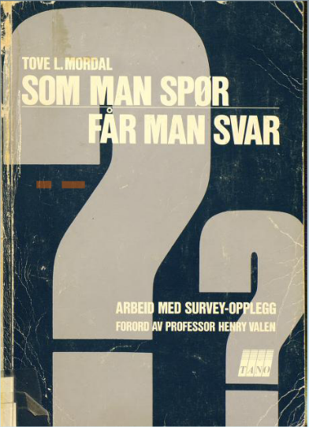

# Spørreskjema: Det spørs på skjema!

Her blir et spørreskjema fra befolkningsundersøkelser overført ved hjelp av en «<a href="https://snl.no/pantograf%2Fapparat_for_å_gjengi_tegninger">pantograf</a>» og hullkort.

Bruk av spørreskjema er kanskje en av de mest brukte innsamlingsmetodene, ikke bare i Holbergprisen i skolen, men i samfunnsvitenskapelig forskning i det hele tatt. I forskningsøyemed er spørreskjema og måten det brukes på, en relativt ny oppfinnelse. Den britiske altmuligmannen Francis Galton (1822–1911) var den første som brukte spørreskjema og visse statistiske metoder for å forske på menneskesamfunn. Grunnen til at spørreskjema er mye brukt er at det er en kostnadseffektiv måte å samle inn større mengder strukturert data på. Nøkkelordet her er «strukturert». At et spørreskjema, eller et intervju er strukturert, betyr egentlig at alle spørsmålene følger en bestemt rekkefølge og har forhåndsbestemte svaralternativer. Dette gjør det enkelt å oversette alle responsene til verdier som igjen kan inngå i statistiske analyser.

Selv om spørreskjema er en populær metode, så er det vanskelig å lage et godt spørreskjema. _Skikkelig vanskelig_. Spesielt om dere skal undersøke sosiale, kulturelle og kanskje psykologiske spørsmål som ikke lar seg definere veldig klart. Om dere skal ta i bruk spørreskjema er det ekstra viktig å ha forskningsspørsmålet klart for dere, og at dere gjerne har laget delspørsmål eller hypoteser. Det kan være fristende å legge inn mange spørsmål i skjemaet, spesielt når man ikke helt vet hva man ser etter. Dere bør være forsiktige med å gjøre dette. Ha i mente at dere også må transkribere (dersom skjemaet er på papir) og analysere datamaterialet. Tenk også på at respondenter kan være utålmodige. Det kan være krevende å svare på et spørreskjema, spesielt dersom tvinges til å tenke over egen oppførsel og holdninger. Om skjemaet er for langt, vil respondentene kanskje begynne å *rushe* seg gjennom for å bli ferdig.

Dere er antagelivis allerede godt trent i å svare på spørreskjema, og dere har sikkert flere ganger opplevd at det er vanskelig eller umulig å svare slik dere som dere helst ville. Nå som dere står på andre siden av denne prosessen, er det viktig å huske på at respondentene deres ikke nødvendigvis vet hva dere har tenkt i spørsmålsutformingen. Derfor er det viktig at dere lager så entydige spørsmål som mulig – det vil si at de ikke kan tolkes på mer enn én måte. Det er derfor lurt å teste ut spørreskjemaet og be om tilbakemeldinger på det før dere sender det ut. Først på hverandre, klassekamerater eller noen i familien. Dere vil garantert finne spørsmål som bør omformuleres.

## Hvordan lage et spørreskjema

Dersom du søker på «how to make a questionnaire» i Google får du i overkant av 23 millioner søketreff. Søker man på «questionnaire research method» i Google Books, får man opp over én million boktitler hvor man angivelig kan lese om dette temaet. Det gir en indikasjon på at det er mange hjul som allerede er oppfunnet der ute. Dere skal med andre ord ikke bare sette dere ned og bare lage et spørreskjema. Eller, jo, gjør det.

Å forske handler i stor grad om å tenke og diskutere. Det dere kan begynne med er å lage et idékart over spørsmål som dere synes virker relevante. Skriv dem ned. Finn gjerne flere måter å formulere det samme spørsmålet på. Det bør ikke ta for lang tid før dere har en del spørsmål, kanskje til og med med svaralternativer. Grunnen til vi begynner med en slik idémyldring er for å ta vare på ideene og forutantagelsene dere har om forskningsspørsmålet.

Det er nemlig veldig stor sjanse for at noen andre allerede har forsket på noe som ligner det dere skal forske på, eller kommet på de samme tingene å spørre om. Det er også sannsynlig at disse forskerne har hatt mye mer tid, erfaring og ressurser enn dere til å utforme gode spørreskjema. Akkurat det kan komme dere til nytte! I forskning er det nemlig lov, og helt nødvendig, å bygge på andre sine erfaringer. Så lenge man henviser til hvor man har fått idéene fra. Det neste steget blir for dere å finne ut om det finnes eksisterende spørreskjema relatert til det dere holder på med.

<a href="http://urn.nb.no/URN:NBN:no-nb_digibok_2007090704001"><em>Som man spør får man svar</em> av Tove Mordal</a> er en gammel, men god innføringsbok i spørreskjema-metode.

Dere kan selvfølgelig begynne med å lete frem spørreskjemaene til store undersøkelser som _World Values Survey_ og _International Social Survey Programme_ (se infoboks) som dere får tilgang på gjennom Norsk Samfunnvitenskapelig Datatjeneste. Dere kan også prøve å søke i [_Google Scholar_][3023-0001], [_DUO_][3023-0002], eller [_BORA_][3023-0003] om dere finner spørreskjema der. Det finnes flere tonn med metodebøker som gir snedige og godt uttenkte retningslinjer for hvordan man skal lage spørreskjema. En av de bedre bøkene på norsk er [_Som man spør, får man svar_](http://urn.nb.no/URN:NBN:no-nb_digibok_2007090704001) (1989) av Tove L. Mordal. Den virker kanskje ikke like ny og moderne som en del andre metodebøker, men det er grunn til at permene ser så slitt ut på den digitale utgaven til Nasjonalbiblioteket: Den har blitt brukt mye, fordi den er god.

[3023-0001]: http://scholar.google.com/
[3023-0002]: https://www.duo.uio.no/
[3023-0003]: https://bora.uib.no/

Det er selvsagt også mulig å spørre forskere og fagpersoner om hjelp. De kan ofte peke dere i riktig retning og komme med verdifulle erfaringer. Noen vil kanskje være skeptiske til å gi fra seg egne metodeopplegg, noe man skal ha forståelse for, ettersom det ofte ligger mye arbeid bak og man ikke vil risikere at det blir brukt på måter som det ikke var tiltenkt. Igjen, det er viktig å huske på at det ikke er rimelig at andre skal gjøre tankearbeidet for dere. Derfor, når dere skal ta kontakt med noen, kan det være lurt å skrive kort hva dere har gjort og tenkt og være konkrete i hva dere spør om.

## Å stille spørsmål

Man kan lære mye av å bare utforske og prøve ut et eksisterende spørreskjema. Dere vil fort se at det finnes mange måter å utforme spørsmål på. Fra de enkle «ja, nei, vet ikke»-spørsmål til holdningsskalaer med opp til ti punkter. Det finnes også de mer kreative utformingene hvor man bes om å plassere følelser på en todimensjonal akse. Ingenting er tilfeldig i et godt spørreskjema. Det kan ligge mye teori og diskusjon bak ordlyden, rekkefølgen og plasseringen av spørsmål (en skitten hemmelighet i akademia er at noen ganger er det _ikke_ særlig tankearbeid bak slike skjema). Hensikten er hele tiden å måle det man hevder man skal måle.

Det første man skal tenke på i forbindelse med hvert spørsmål er hva det er man skal måle. Er det om respondentens _person_ (for eksempel kjønn, alder, utdanning eller bosted). Er det om respondentens _holdninger_ (for eksempel om politiske, religiøse, etiske eller kulturelle spørsmål)? Er det om respondentens _adferd_ (for eksempel mat-, trenings-, underholdnings- eller arbeidsvaner). Er det om respondentens _valg_ (for eksempel i en gitt økonomisk situasjon)? Er det om respondentens _tro_ (for eksempel om guder, hellige bøker eller religiøse problemstillinger? For alle disse eksemplene finnes det mange hensyn og mange fremgangsmåter.

Det er ingen som forventer at dere skal lage det perfekte spørreskjemaet. Den eneste måten å bli god på dette er å starte et sted. Dere kommer antagelivis til å være 120 % bedre på kvantitative forskningsmetoder etter dere har gjennomført den første innsamlingen. Poenget er at dere skal være klar over hvor utfordringene ligger. Dere skal også være klar over at dere ikke kan bruke spørreskjemaet til å si hva som helst for sikkert. Det er heller ikke poenget. Poenget er å få en følelse for hva forskere gjør og hvor givende det er å lage sitt eget datamateriale. Fordi det _er _gøy!

Bruk maks et kvarter og finn ut:

  * Hva er de tre mest interessante spørsmålene dere ønsker å belyse med spørreskjemaet?
  * Hvilken bakgrunnsinformasjon _må _dere ha?
  * Vil det være enklest å få tak i respondenter med et skjema på papir eller via web?
  * Hvor lang tid skal dere gi respondentene til å svare? Dere skal ha tid til å gå igjennom datamaterialet også.

Lenker til spørreskjematjenester på web

  * [SurveyMonkey][7406-0001]
  * [Wufoo][7406-0002]
  * [Google Forms][7406-0003]

[7406-0001]: https://www.surveymonkey.com/
[7406-0002]: http://www.wufoo.com/
[7406-0003]: http://www.google.com/forms/

Dersom dere bruker spørreskjema over web vil dere som oftes kunne velge mellom forskjellige spørsmålstyper. Som dere sikkert vet finnes det forskjellige måter å oppgi et spørsmål og svaralternativer på. Dette kan dere finne mye mer om i metodelittatur, men her er de viktigste å vite om:

**Spørsmål med gjensidig utelukkende svaralternativer**

Eksempel: Hva er ditt hovedmål?

-   (1) Nynorsk
-   (2) Bokmål
-   (3) Annet morsmål: ____ (skriv inn)

**Spørsmål med flervalgsalternativer**

Eksempel: Hvilke av disse strømmetjenestene bruker du? (kryss av for de som passer)

-   [x] Spotify
-   [ ] WiMP
-   [x] YouTube
-   [ ] Netflix
-   [ ] Sumo
-   [ ] NRK.no
-   [ ] Andre

**Spørsmål med holdningskala**

Eksempel: Bør det være obligatorisk med sidemål i norsk skole?

  1. Ja, absolutt
  2. Det bør helst være det
  3. Er verken for eller i mot
  4. Det er ikke så nødvendig
  5. Nei, absolutt ikke

**Åpne spørsmål**

Eksempel: Er du bekymret for klimaendringene? Skriv tre setninger om hvorfor\hvorfor ikke?

## Tenk dere godt om når dere lager spørsmålene:

  * Er spørsmålstillingen entydig, eller kan den (mis)forstås på flere måter?
  * Er spørsmålet ledene eller tungt på den ene siden?
  * Fanger dere opp de som ikke kan svare på spørsmålet?
  * Er det noen av spørsmålene som er personsensitive?

## Husk!

  * Det er bedre med fem gode spørsmål, enn femten dårlige spørsmål
  * Folk er utålmodige! Det er lurt å på forhånd gi dem en idé om hvor lang tid skjemaet vil ta å fylle ut
  * Det kan være lurt å ha svarlalternativ som fanger opp hvorfor man ikke vil svare på et spørsmål: For eksempel «vet ikke»\«vil ikke svare».
  * Begynn gjerne med spørsmål som er enkle å svare på, da «lokker» dere respondenten til komme i gang
  * Det er vanlig å ha såkalte «bakgrunnsvariabler» som kjønn og alder tilslutt i et spørreskjema

## Lesetips

-   [_Som man spør får man svar_ av Tove Mordal, 1989](http://urn.nb.no/URN:NBN:no-nb_digibok_2007090704001)
-   [_Samfunnsvitenskapelige metoder_ av Sigmund Grønmo, 2004](http://bibsys-primo.hosted.exlibrisgroup.com/NB:BIBSYS_ILS961798580)

