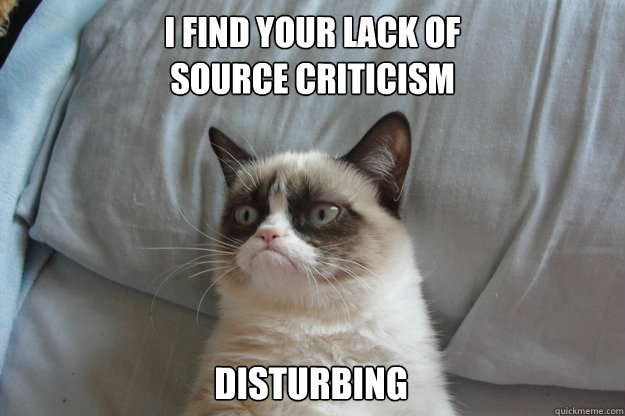

# Vær skeptiske: Kildekritikk

Kildekritikk er kanskje noe dere allerede har hørt om i historiefaget. Enkelt sagt går kildekritikk ut på å vurdere om det kildene forteller oss er sant eller sannsynlig. I denne sammenhengen er _kilder_ det som datamaterialet består av. Veldig ofte er det vanskelig å si helt sikkert hvorvidt det som står i en kilde gir et bilde av den virkeligheten vi ønsker å lære noe mer om. Du kan spørre en historiker om kildekritikk (det er faktisk ikke så veldig dumt, gjør gjerne det), og vedkommende kan antagelivis snakke timevis om hvordan det kan gjøres.

Begrepet _kritikk_ i forskning ikke betyr det samme som i vanlig dagligtale.

Ordet «kildekritikk» kan høres ut som at man skal være negativt innstilt til datamaterialet sitt. Kritikk handler om at vi ikke tar noe for gitt, bare fordi det står skrevet en plass, eller fordi noen har sagt at det er slik. Det går på det samme som allerede er gjentatt mange ganger i denne metodeboken: Å alltid stille spørsmål og at spørsmålene man stiller er gode.

Selv om ordet kildekritikk er mest utbredt i historiefaget, er det egentlig noe de fleste fag og forskere driver med. Vi er ikke bare kildekritiske til datamaterialet og kildene våre, vi er også kildekritiske når vi leser annen forskning eller kilder til kunnskap. Har dere for eksempel tenkt på hvem som har skrevet lærebøkene dere bruker. Vet dere noe om hvem de er, eller hvordan de har gått frem for å komme til kunnskapen sin? Hvordan kan dere vite at det jeg skriver om forskning i denne digitale boken gir et pålitelig bilde av hvordan forskere arbeider? Å være kildekritisk betyr ikke at dere ikke lengre kan stole på at kilder eller personer gir et korrekt bilde av virkeligheten, men at dere er nødt til å kikke dem nærmere i kortene.

# Wikipedia, en gullgruve for kildekritikk

Noen av dere har kanskje fått høre at man ikke bør bruke [Wikipedia](http://no.wikipedia.org) som kilde. Det er sånt som voksne sier fordi de (1) ikke skjønner hvordan Wikipedia virker og/eller (2) ikke stoler på at dere er kildekritiske nok. Dersom man setter seg inn i Wikipedia finner man raskt ut at det faktisk er lettere å bruke det kildekritisk sammenlignet med andre oppslagsverk. For første skal det som står på Wikipedia stort sett ha referanser til sekundærlitteratur (det er det dere ser i fotnotene). At det er referanser der betyr ikke nødvendigvis at teksten er mer pålitelig men det er mulig å vurdere hvorvidt disse kildene er pålitelige. For det andre kan dere bla i historien til selve artikkelen og se hvilke endringer og diskusjoner som har blitt foretatt. Da kan dere finne ut om noen er uenige i innholdet i artikkelen og eventuelt hvorfor. Det kan faktisk være et forskningsprosjekt i seg selv å analysere hvordan slike wikipedia-artikler utvikler seg.

Når vi i Holbergprisen i skolen sier at dere skal være kildekritiske betyr det at i er interesserte i hvordan dere vurderer kildene. Å være kildekritisk betyr ikke nødvendigvis at dere må være 100 prosent sikre på kildene for å bruke dem, eller at dere må se vekk i fra alt som dere er usikre på. Sånn er det aldri for forskere. Det er helt greit å være usikker, men da er det viktig å fortelle _hvorfor_ dere er det, og gjerne hva dere kunne ha gjort dersom dere hadde hatt mer tid og ressurser.

## Å være kildekritisk betyr at dere:

  1. Har tenkt på hvilke typer kilder dere bruker og hvordan de er forskjellige.
  2. Skriver ned og forklarer hvordan dere vurderer disse kildene.

### Her noen enkle eksempel på hvordan man komme i gang med kildekritikk.

**Hvilke type kilder er det? Er det dokumenter fra et akriv, er det transkriberte intervju, eller er det en fagbok?**

_Eksempel: Kildene våre består av 20 dokumenter fra byarkivet, tre intervjuer og en bok om fisketorgets historie._

**Hvordan har kilden blitt til? **

Eksempel: Dokumentene fra byarkivet er skrevet av sekretærer i Bergen kommune mellom 1973 og 1976. Intervjuene av pensjonistene på Solsiden eldresenter har vi selv gjort i september, 2015. Boken er skrevet av historiker Hermund Torskenes i 1984.

**Hvordan belyser kilden forskningspørsmålet?**

Eksempel: Arkivdokumentene viser hvilke forhandlere som hadde salgsløyve på firsketorget i perioden 1972–1975. Intervjuene er førstehåndsberetninger av to som jobbet med fiskehandel på syttitallet. Boken gir en historisk bakgrunn for å forstå hvordan fisketorget har forandret seg. Ut fra dette har vi et sammenligningsgrunnlag som vi kan bruke til belyse spørsmålet om fisketorget virkelig var så mye bedre før.

**Hvorfor er det sannsynlig at kildene kan belyse forskningsspørsmålet?**

Eksempel: Ingen av fiskehandlerne i disse dokumentene ville stått der om de ikke hadde søkt kommunen om salgsløyve. Det var derfor sannsynlig at disse også ville ha vært på fisketorget denne perioden. Noe som ble sannsynligjort da vi fikk kontakt med noen av som stod der. Intervjuene er erindringer fra noen som faktisk var der i denne perioden, men det er rundt 40 år siden og det er ikke sikkert hukommelsen alltid stemmer med det som faktisk skjedde. _Fisketorgets historie_ er skrevet av en som er professor i historie, men samtidig vet vi at han var veldig kritisk til hvordan det ble drevet. Vi er derfor usikre på hvor han kan ha smørt tykt på og hvor han kan ha utelatt ting.

## Husk å være kritisk til statistikk også

Dersom deres skal bruke statistiske kilder, gjelder det også å være kildekritiske. Tall og grafer røper kanskje enda mindre om hvor de kommer fra enn andre tekster og historiske dokumenter. Spesielt når tallene er knyttet opp mot politiske spørsmål bør man være forsiktig.[^1] En tommelfinger-regel er at man går til offisielle og annerkjente nettsider som Norsk samfunnsvitenskapelig datatjeneste ([NSD](http://nsd.uib.no)) og Statistisk sentralbyrå ([SSB](http://ssb.no)).

## Lesetips

-   [_Mål og mening: om feiltolkning av meningsmålinger_, Ottar Hellevik, 2011.](http://urn.nb.no/URN:NBN:no-nb_digibok_2013102406005)

[^1]: [Denne bloggposten](http://tjomlid.com/2013/12/20/realitetsorientering-2/) av Gunnar Tjomlid er et eksempel på hvordan man kan være kildekritisk til statistikk og kvantitative generaliseringer
