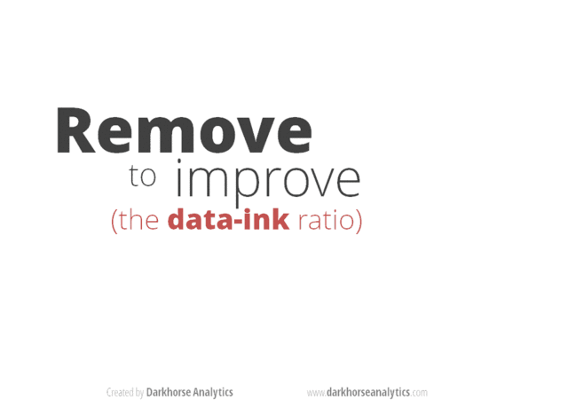

# Hvordan kan forskningsrapporten se ut?

Dere har 15 sider til rådighet.

Det er faktisk ikke særlig mye.

Nedenfor finner dere et *forslag* til hvordan dere kan strukturere forskningsrapporten. Det som er mest interessant for oss er det dere gjør med datamaterialet dere har samlet, og hvorfor dere har tatt de valgene dere har tatt. Det kan være lurt å ta en liten titt på de prosjektene som tidligere har blitt nominert og vunnet Holbergprisen i skolen. Femten sider virker kanskje mye når dere begynner på prosjektet, men dere vil merke mot slutten at dere gjerne skulle hatt mer plass.

## Bruk av sitater og eksempler fra datamaterialet

La aldri et sitat står for seg selv. En grei regel er at et avsnitt aldri skal slutte med et sitat. Dere må forklare hva dette sitatet forteller oss. Det kan være greit å se etter sitater som tydelig belyser det dere spør etter i forskningsspørsmålet. Det samme gjelder grafer, tabeller, bilder og andre utdrag fra selve datamaterialet. Det er kun interessant når dere gjør rede for hvordan det belyser forskningsspørsmålet.

## Tabeller og grafer

Dere aner ikke hvor mange stygge tabeller og grafer som finnes der ute i akademia. De fleste nøyer seg med å kopiere tabeller og grafer rett ut fra Excel eller statistikkprogrammet man bruker. Ofte legger man inn alt for mye informasjon og unødvendig grafikk i tabeller og grafer. Tabeller og grafer fungerer best når de er enkle. En tommelfingerregel er å kutte vekk mest mulig, og kun sitte igjen med det som er interessant. Det er sjelden å inkludere den samme informasjonen flere ganger, ha mange desimaler, farger eller linjer.

Det er også mulig å la seg inspirere og lage pene grafer med nettsider som [plot.ly](http://plot.ly).

## Kildehenvisninger og referanser

Det er også utrolig viktig å gi hverandre kred i vitenskapen. Vanligvis gjøres dette med hjelp av referanser og kildehenvisninger. Dere er allerede kjent med at det å kopiere tekst fra internett og presentere det som noe man har skrevet selv, ikke er særlig lurt. Om en forsker eller student gjør det samme kan det føre til oppsigelse og utstengelse fra universitetet. Uredelighet er ikke hovedgrunnen til at det er viktig å bruke referanser. Med kildehenvisninger og referanser inviterer vi andre til å gå i de samme sporene som vi selv har tråkket opp. Det gjør det lettere for andre å vurdere forskningen vår, men også bygge videre på den. [På nettsidene til Søk og skriv finner dere gode retningslinjer for kildebruk og referanser.][1] Det er nemlig bra å bygge på andres kunnskaper, sitere og vise til innsikter i andre forskningsarbeider. Det er også utrolig praktisk fordi man slipper å skrive alt på nytt (det er også grunnen til dere finner masse henvisninger i dette heftet ). Med en henvisning sier du at «her er det en forsker som har brukt tid på utforske denne saken, teorien eller metoden, om du vil vite mer kan du gå hit for å finne det ut». Dette er et _forslag_ til hvordan forskningsartikkelen kan se ut.

   [1]: http://sokogskriv.no/kildebruk-og-referanser/

## Forslag til struktur

  * Kort intro (2 sider)

    * Hva handler forskningsprosjektet om?
    * Hvorfor er det interessant?
    * Hva håper dere å lære noe mer om?
    * Hva er forskningsspørsmålet og hvordan kom dere frem til det?

  * Kort bakgrunn (1-2 sider)

    * Har det blitt gjort forskning på dette før?
    * Kort bakgrunn for det dere skal forske på (hva, hvor, når, hvem osv).

  * Kort metodevalg (1-2 sider)

    * Hvordan valgte dere forskningsmetode?
    * Hva vurderer dere forskningsetikken i prosjektet?
    * Hvordan og hvorfor går dere frem som dere gjør?

  * Refleksjoner fra datainnsamlingen (to store utfordringer) (1 side)

    * Hva gikk etter planen, og hva gikk ikke etter planen?

  * Refleksjoner fra analysen av datamaterialet (5 sider)

    * Kvantitativ og kvalitativ oversikt over datamaterialet?
    * Gjennomgang av relevante funn.
    * Hva er fremtredende, viktig eller interessant?

  * Refleksjoner om hvorfor\hvordan analysen belyser forskningsspørsmålet (3 sider)
  * Refleksjoner om hvordan forskningsprosjektet har gått (1 side)

    * Hva kunne dere gjort annerledes?
    * Hvor kunne dere tatt forskningen videre?

  * Tillegg
    *   Litteraturliste
    *   Spørreskjema
    *   Kodebok (dere kan også bare oppgi en lenke til denne om dere har den i Google Docs)
